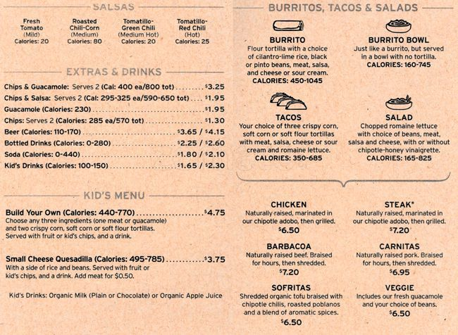

Reinforcement Learning is a computational approach to interaction-based learning. When you are learning how to walk, you are not told by anyone how much force to apply to each of your muscles. Instead, you repeatedly try to walk, and learn how to walk by favoring actions that helped you take a step and avoiding actions that led you to fall.

Reinforcement Learning is different from other fields of Machine Learning such as Supervised Learning or Unsupervised Learning. Instead of the other two fields of Machine Learning where a labeled or unlabeled data set is given to the learner, in Reinforcement Learning, the learner accumulates the data by interacting with the environment. Through **trial and error**, the learner eventually learns favorable actions.

The goal of an agent in Reinforcement Learning is to maximize the reward by selecting "correct" actions. This is challenging because previous actions often affect your current state, action, and reward. If you stepped on a slippery ice on your last step and lost your balance, you will fall down in the next few steps. In other words, actions can have **delayed reward**: the effect of an action might not be apparent from its immediate reward.

Because the learner or agent learns by interacting with the environment, it has to balance **exploration and exploitation**. The agent seeks to maximize its total reward, so it should *exploit* its knowledge and choose the action that will give the agent the most reward. However, to find this action, it needs to *explore* and test actions to estimate their rewards.

For example, suppose a new restaurant opens near your house. At first, you do not know what their best dish is, so you try different dishes (exploration). Once you tried a few dishes, you prefer a particular dish and order it most times (exploitation). However, there are still some dishes in the menu you have not tried, so sometimes you order other dishes. Also, for some dishes, you might have been unlucky last time you ordered it (bad ingredient, novice chef, etc.), so you might order a dish you did not like.

*This is a summary of Sections 1.1, 1.2, 1.4 of Reinforcement Learning: An Introduction by Richard S. Sutton and Andrew G. Barto. You can find the full book [in their website](http://incompleteideas.net/book/the-book-2nd.html).*