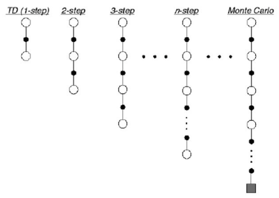
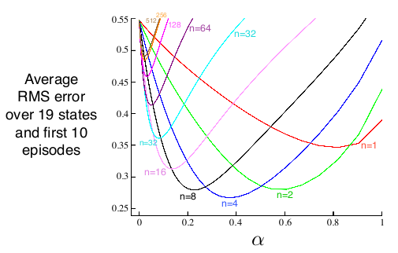

Bias-variance tradeoff is a familiar term to most people who learned machine learning. In the context of Machine Learning, bias and variance refers to the model: a model that underfits the data has high bias, whereas a model that overfits the data has high variance. A model with high bias failed to find all the pattern in the data so it does not fit the training set well, so it will not fit the test set well either. A model with high variance fits the training set very well, but it fails to generalize to the test set because it also learned the noise in the data as patterns.

In Reinforcement Learning, we consider another bias-variance tradeoff. This leads to a lot of confusion, because in Deep Reinforcement Learning, both cases of bias and variance exist. Therefore, it is important to have a clear understanding of what estimator we are referring to when we talk about bias and variance.

### Monte Carlo and Temporal Difference Learning

Reinforcement Learning is a field of Machine Learning where the agent learns not through a fixed dataset but by interacting with the environment. In most Reinforcement Learning methods, the goal of the agent is to estimate the state value function $v_{\pi}(S_t)$ or the action value function $q_{\pi}(S_t, A_t)$. Value functions describe how desirable the state $S_t$ and action $A_t$ is to the agent. For this post, we use the state value function $v_{\pi}$, but the same idea applies to the action value function $q_{\pi}$.

The state value function $v_{\pi}(S_t)$ is defined the expected total amount of rewards received by the agent from that state $S_t$ until the end of the episode. In most cases, the agent cannot accurately predict the results of its action, so it is impossible for the agent to precisely calculate the state or action values. Thus, it needs to *estimate* them iteratively. This estimation is where bias and variance is introduced.

The estimate $V_{\pi}(S_t)$ of the true value function $v_{\pi}(S_t)$ is updated with the following formula:

$$ V_{\pi}(S_t) \leftarrow V_{\pi}(S_t) + \alpha (\text{Target} - V_{\pi}(S_t))$$

This formula is just an weighted average of $V_{\pi}(S_t)$ and $\text{Target}$, with the weight specified by the learning rate $\alpha$. In other words, on every update $V_{\pi}(S_t)$ takes a step towards the $\text{Target}$. The $\text{Target}$ used for the update defines the method. There are two basic methods for iteratively estimating the value function: **Monte Carlo** (MC) method and **Temporal Difference** (TD) method.

In Monte Carlo method, the return $G_t$ is used as the $\text{Target}$. $G_t = R_{t+1} + \gamma R_{t+2} + \ldots $ is the discounted sum of rewards from state $S_t$ until the end of the episode. You are not mistaken if you think the definition sounds similar to the definition of $v_{\pi}(S_t)$: in fact, $v_{\pi}(S_t) = \mathbb{E}[G_t]$.

In TD method, instead of waiting until the end of the episode, the $\text{Target}$ is the sum of immediate reward and the estimate of future rewards. In other words, $\text{Target} = R_{t+1} + \gamma V_{\pi}(S_{t+1})$. In other words, we are updating $V(S_t)$ using the same function $R_{t+1} + \gamma V_{\pi}(S_{t+1})$. This is called **bootstrapping**: we are using an estimated value to update the same kind of estimated value. It is not obvious that this will converge to the true value function $v_{\pi} (S_t)$, but it might help to think that on each update, we take into account new experience ($R_{t+1}$), and as it gains more and more experience, $V_{\pi}(S_t)$ approaches $v_{\pi}(S_t)$.

### Bias and Variance in Reinforcement Learning

The idea of Bias-variance tradeoff appears when we compare Monte Carlo with TD learning. Remember that when we talk about bias and variance for these two methods, we are talking about the bias and variance of their target values.

Let's first look at the bias. A bias of an estimator $\hat{\theta}$ is defined as $\mathbb{E}[\hat{\theta}] - \theta$. In this case, we are estimating $v_{\pi}(S_t)$, so $\text{Bias} = \mathbb{E}[\text{Target}] - v_{\pi}(S_t)$. By  definition of the value function: $v_{\pi}(S_t) = \mathbb{E} [G_t]$ , so the return $G_t$ is an unbiased estimate of $v_{\pi}(S_t)$.

In contrast, bias exists in the TD target $R_{t+1} + \gamma V_{\pi}(S_{t+1})$. The reward $R_{t+1}$ and $S_{t+1}$ are directly from the sample so it is unbiased, but $V_{\pi}(S_{t+1})$ is an estimate of the value function and not the true value function $v_{\pi}(S_{t+1})$, so the TD target is biased. Note that there is a lot of bias in the beginning of training where the estimate $V_{\pi}$ is far from $v_{\pi}$, and as the estimate improves, the bias subsides.

The variance of an estimator denotes how "noisy" the estimator is. Because $G_t$ is a (discounted) sum of all rewards until the end of the episode, $G_t$ is affected by all actions taken from state $S_t$. For example, if there are two trajectories after taking an action $A_t$ and their returns are very different, individual returns $G_t$ would be far from the true value function $v_{\pi}(S_t)$. Therefore, variance of $G_t$ is high.

In contrast, $R_{t+1} + \gamma V_{\pi}(S_{t+1})$ has low variance. The target $R_{t+1} + \gamma V_{\pi}(S_{t+1})$ only depends on the immediate reward $R_{t+1}$. Compared to Monte Carlo target $G_t = R_{t+1} + \gamma R_{t+2} + \ldots$, there are less variables to consider in the TD target.

The relative bias and variance of Monte Carlo and TD can be summarized with the table below:

|          | $G_t$ (Monte Carlo) | $R_{t+1} + \gamma V(S_{t+1})$ (TD) |
| -------- | ------------------- | ---------------------------------- |
| Bias     | 0                   | $> 0$                              |
| Variance | High                | Low                                |

### Underfitting and Overfitting in Reinforcement Learning

Another way to understand the table above is to use the idea of underfitting and overfitting. [Matthew Lai from DeepMind](http://qr.ae/TUppf6) explained this with the concept of **eligibility traces**: given a reward, find which actions led to this reward. Unfortunately, it is often impossible to precisely determine the cause of our death. Thus, we use a simple heuristic: we believe that actions close to the reward (in timestep) are more likely causes of reward.

Suppose that our agent in a "real life" environment died. To improve, we need to consider what actions led to our death so we can perform better. It is likely that its death was caused by actions close to its death: crossing the sidewalk in a red light or falling down a cliff. However, it is also possible that a disease it contacted several months ago is the cause of our death, and every action after had minimal impact to its death.

The Monte Carlo model uses the full trace: we look at all actions taken before the reward. Because we consider all actions, there will be a lot of noise. If we consider what actions the agent took in its entire lifetime, we will definitely find patterns, but most patterns will be coincidences, not actual patterns that can be generalized to future episodes. In other words, the Monte Carlo will overfit the episode.

On the other end, with the Temporal Difference model, the agent only looks at the action immediate before its death. In this case,the agent will most likely fail to find any pattern or generalization, since most actions have delayed rewards, so the last action was not the cause of its death. Therefore, the Temporal Difference model will underfit the episode.

### $n$-step Bootstrapping

If Monte Carlo method overfits and TD method underfits, then it is natural to consider the middle ground. We don't want to only consider the last action, but we also don't want to consider all actions made. so we consider $n$ steps. This is called **$n$-step bootstrapping**. 

At the cost of an extra hyperparameter $n$, the $n$-step bootstrapping method works better than Monte Carlo or TD. 

### Conclusion

Bias and Variance is a significant problem in Reinforcement Learning, as they can slow down the agent's learning. For simple environments, Monte Carlo method or Temporal Difference method work well enough, but for complex environments $n$-step bootstrapping can significant boost learning.